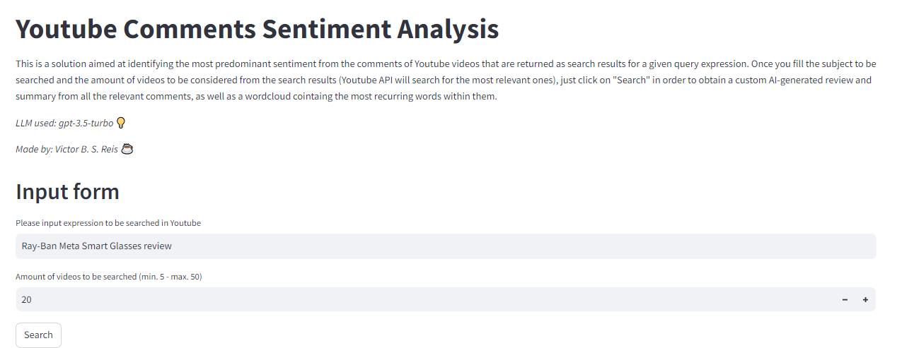
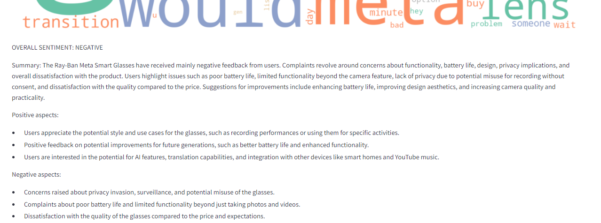
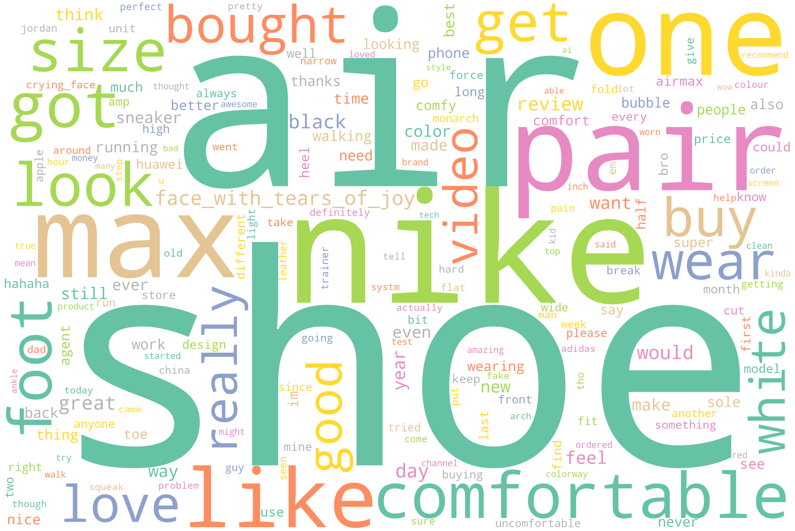
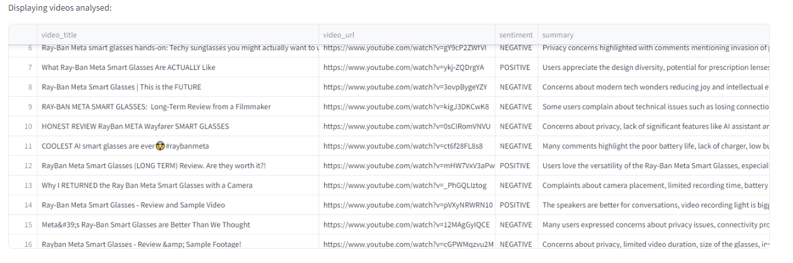

# AI-Powered YouTube Sentiment Scanner <a class="anchor" id="top-bullet"></a>




---

Victor B. S. Reis - Sep, 2024

## The Problem
- Small business owners, startups, and marketing teams are eager to understand how their products or services are being received in the market
- They wish for insights into customer opinions and trends, particularly on platforms like YouTube, to gauge performance and evaluate marketing KPIs
- Whether it's tracking product popularity or identifying sentiment, these businesses rely on real-time feedback to make data-driven decisions!

## Project Overview
This project aims to help users discover and analyze customer sentiment from Youtube video comments by:
- Searching for a given term, for example a product name
- Presenting the resulting video list from the research, while labeling each title as relevant or not
- Each video will have their comments analyzed based on their content
- Using NLP and AI, each comments will be classified under specific sentiment categories (Positive, Negative or Neutral)
- Presenting the sentiment analysis results via word clouds and brief descriptions that highlight key insights from the data

## Steps
- **Search for an expression/name (YouTube API):**
    - The YouTube Data API is used to retrieve a list of videos related to the search term
    - Python’s requests library interact with the API and parse the video metadata for further analysis
    
- **Classify Relevant Videos (ChatGPT/LLM Classification):**
    - Each video returned from the search is filtered by relevance using an LLM
    - Python’s openai library interacts with the LLM, where the video title and description are sent to classify whether the video is relevant or not (using a custom prompt).
    
- **Pre-process Comments:**
    - Once relevant videos are selected, the project uses the YouTube API to retrieve comments from each video.
    - Text preprocessing steps like tokenization, removal of stop words, and basic cleaning are performed using libraries like nltk or spacy.

- **Classify Sentiment (ChatGPT/LLM Sentiment Analysis):**
    - Comments from each video are passed to the LLM, which classifies the overall sentiment of each one as Positive, Neutral, or Negative.
    - This is accomplished by using the OpenAI library to communicate with the LLM, with a customizable prompt to reflect the video’s context.
    - Results are saved into a Pandas DataFrame for structured analysis.
    
- **Word Cloud Generation:**
    - The most frequent terms in positive and negative comments are visualized in a word cloud.
    - Python’s wordcloud library is used to create these visualizations, offering a quick overview of the most discussed terms.
    
- **Final Summary and Insights (Sentiment & Summary Generation):**
    - For each video, a brief summary is generated based on the most frequent sentiments and key opinions.
    - The LLM produces a concise description highlighting significant trends (e.g., “Most users love the product’s design but complain about its price”).
    - The overall sentiment rating is aggregated and visualized for user interpretation.


## Table of Contents:
* [Preparing Inputs](#second-bullet)
* [Pre-processing Comments](#third-bullet)
* [Classifying Sentiment](#fourth-bullet)
* [Deployment in Production](#fifth-bullet)
* [Results and Future Improvements](#sixth-bullet)

---

# Preparing Inputs<a class="anchor" id="second-bullet"></a>
The first step is to search for video results and classifying their relevance based on a search expression, like a product name.

### Imports


```python
import pandas as pd
import numpy as np
import nltk
import emoji
import re
import requests
import os
from openai import OpenAI
from matplotlib import pyplot as plt
from nltk.corpus import stopwords
from nltk.tokenize import word_tokenize
from unidecode import unidecode
from nltk.stem import WordNetLemmatizer 
from nltk.tokenize import word_tokenize
from wordcloud import WordCloud
from langdetect import detect, DetectorFactory
from googleapiclient.discovery import build
```


```python
# keys 
api_key = ''
openai_key = ''
```

### Loading API and testing retrieval
First we try to initialize the youtube API based on the official documentation and return all the comments from a video based on its ID


```python
def load_api(api_key):
    # Set up the API
    youtube = build('youtube', 'v3', developerKey=api_key)
    return youtube

# Fetch comments
youtube = load_api(api_key)
```


```python
# Example usage
video_id = 'i1GXJFH8xm4'

# make a request for the comment threads
comments = []
comments_request = youtube.commentThreads().list(
    part="snippet",
    videoId=video_id,
    maxResults=100
)
response = comments_request.execute()

# make a request for video info
video_request = youtube.videos().list(
        part="snippet",
        id=video_id
    )
video_response = video_request.execute()
```

### Search for video results

After obtaining a good understanding on how the data from a video is returned from the API, now we create a function to search for multiple videos based on a search expression:


```python
def search_videos(search_query, api_key):
    max_results = 10  # Number of videos to retrieve
    API_KEY = api_key

    url = f"https://www.googleapis.com/youtube/v3/search?part=snippet&maxResults={max_results}&q={search_query}&type=video&key={API_KEY}"

    response = requests.get(url)
    data = response.json()

    # Extract video IDs and URLs
    video_data = []
    for item in data['items']:
        video_id = item['id']['videoId']
        video_title = item['snippet']['title']
        video_description = item['snippet']['description']
        video_url = f"https://www.youtube.com/watch?v={video_id}"
        
        # append to the list
        video_data.append({
            'video_id': video_id,
            'video_title': video_title,
            'video_description': video_description,
            'video_url': video_url
        })
        
    return pd.DataFrame(video_data)
```


```python
# quick test
df_videos = search_videos("Ray-Ban Meta Smart Glasses", api_key)
display(df_videos)
```


<div>
<style scoped>
    .dataframe tbody tr th:only-of-type {
        vertical-align: middle;
    }

    .dataframe tbody tr th {
        vertical-align: top;
    }

    .dataframe thead th {
        text-align: right;
    }
</style>
<table border="1" class="dataframe">
  <thead>
    <tr style="text-align: right;">
      <th></th>
      <th>video_id</th>
      <th>video_title</th>
      <th>video_description</th>
      <th>video_url</th>
    </tr>
  </thead>
  <tbody>
    <tr>
      <th>0</th>
      <td>E1LW_MteTho</td>
      <td>Introducing the Ray-Ban Meta Smart Glasses Col...</td>
      <td>Meet the next generation of smart glasses. The...</td>
      <td>https://www.youtube.com/watch?v=E1LW_MteTho</td>
    </tr>
    <tr>
      <th>1</th>
      <td>pgiWqkvIclk</td>
      <td>The Ray-Ban Meta Smart Glasses are a turning p...</td>
      <td>Smart glasses have always been a hard sell, bu...</td>
      <td>https://www.youtube.com/watch?v=pgiWqkvIclk</td>
    </tr>
    <tr>
      <th>2</th>
      <td>ViA4-YWx8Y4</td>
      <td>Meta Ray-Ban Smart Glasses Review - 6 Months L...</td>
      <td>Have the Meta Ray-Ban Smart Glasses been worth...</td>
      <td>https://www.youtube.com/watch?v=ViA4-YWx8Y4</td>
    </tr>
    <tr>
      <th>3</th>
      <td>gY9cP2ZWfVI</td>
      <td>Ray-Ban Meta smart glasses hands-on: Techy sun...</td>
      <td>Meta has almost completely revamped its high-t...</td>
      <td>https://www.youtube.com/watch?v=gY9cP2ZWfVI</td>
    </tr>
    <tr>
      <th>4</th>
      <td>utSc7DxIvTU</td>
      <td>RayBan Meta SMART GLASSES Review and MY HUGE M...</td>
      <td>I made a HUGE mistake when ordering the RayBan...</td>
      <td>https://www.youtube.com/watch?v=utSc7DxIvTU</td>
    </tr>
    <tr>
      <th>5</th>
      <td>rdUqyu7kTh4</td>
      <td>The RayBan Meta Smart Glasses are a must have ...</td>
      <td>It's funny, if you ask a content creator what ...</td>
      <td>https://www.youtube.com/watch?v=rdUqyu7kTh4</td>
    </tr>
    <tr>
      <th>6</th>
      <td>yj9_lRvbbNU</td>
      <td>Rayban Meta Smart Glasses cannot secretly reco...</td>
      <td></td>
      <td>https://www.youtube.com/watch?v=yj9_lRvbbNU</td>
    </tr>
    <tr>
      <th>7</th>
      <td>ct6f28FL8s8</td>
      <td>COOLEST AI smart glasses are ever🤯#raybanmeta</td>
      <td>This is Called the meta rayban glasses that ar...</td>
      <td>https://www.youtube.com/watch?v=ct6f28FL8s8</td>
    </tr>
    <tr>
      <th>8</th>
      <td>6d3Wv4benng</td>
      <td>Gadget or Glasses? Discover the Ray-Ban Meta |...</td>
      <td>Gadget or Glasses? Discover the Ray-Ban Meta |...</td>
      <td>https://www.youtube.com/watch?v=6d3Wv4benng</td>
    </tr>
    <tr>
      <th>9</th>
      <td>ykj-ZQDrgYA</td>
      <td>What Ray-Ban Meta Smart Glasses Are ACTUALLY Like</td>
      <td>Ray-Ban Meta https://geni.us/jZMqUE The mic I ...</td>
      <td>https://www.youtube.com/watch?v=ykj-ZQDrgYA</td>
    </tr>
  </tbody>
</table>
</div>


### Evaluating relevance with AI

With the video list, maybe not all of them will contain relevant info or relevant comments for our purpose. We need a way to quickly determine which videos will be relevant or not to the analysis. For this, a LLM will be used, and for a matter of simplicity and cost at this moment OpenAI's API is a good choice, and GPT 3.5 should suffice.

This was thought more as an optional step in order to allow the user double check which videos are about to be analysed and make sure none of them are unrelated to the desired topic, avoiding contamination of the upcoming sentiment analysis.


```python
# function to classify video title as relevant or not for our search
def classify_video(search_query, df_videos, api_key):
    # prompt
    prompt_sistema = f"""You are a marketing analyst skilled in evaluating the relevance of videos for product or topic analysis.
        Given a video title and description, determine if the content is RELEVANT or NOT RELEVANT based on its value for marketing 
        insights, research purposes, or general audience interest. Consider aspects such as alignment with the search term or 
        expression, potential to engage or inform the target audience, and contribution to a comprehensive understanding of the 
        topic. Your goal is to help filtering those videos so stakeholders can understand how their products or services are being 
        received in the market. You will receive a "search_string" for a product or topic that will be researched, as well as a 
        video title and its description. You should analyze each one of them and return only a single string with one of the options:
        ["RELEVANT","NOT RELEVANT"]
        """
    # initialize client
    cliente = OpenAI(api_key=api_key)
    
    # iterate every dataframe row
    for _,item in df_videos.iterrows():
        prompt_user = f"Search query: {search_query}\nVideo title: {item['video_title']}\nVideo description: {item['video_description']}"

        response = cliente.chat.completions.create(
            messages = [
                {
                    "role":"system",
                    "content":prompt_sistema
                },
                {
                    "role":"user",
                    "content":prompt_user
                }
            ],
            model="gpt-3.5-turbo",
            max_tokens=10
        )

        result = response.choices[0].message.content
        df_videos['relevance'] = result
        
        
    return df_videos
```


```python
# quick test
classify_video("Ray-Ban Meta Smart Glasses", df_videos, openai_key)
```


<div>
<style scoped>
    .dataframe tbody tr th:only-of-type {
        vertical-align: middle;
    }

    .dataframe tbody tr th {
        vertical-align: top;
    }

    .dataframe thead th {
        text-align: right;
    }
</style>
<table border="1" class="dataframe">
  <thead>
    <tr style="text-align: right;">
      <th></th>
      <th>video_id</th>
      <th>video_title</th>
      <th>video_description</th>
      <th>video_url</th>
      <th>relevance</th>
    </tr>
  </thead>
  <tbody>
    <tr>
      <th>0</th>
      <td>E1LW_MteTho</td>
      <td>Introducing the Ray-Ban Meta Smart Glasses Col...</td>
      <td>Meet the next generation of smart glasses. The...</td>
      <td>https://www.youtube.com/watch?v=E1LW_MteTho</td>
      <td>RELEVANT</td>
    </tr>
    <tr>
      <th>1</th>
      <td>pgiWqkvIclk</td>
      <td>The Ray-Ban Meta Smart Glasses are a turning p...</td>
      <td>Smart glasses have always been a hard sell, bu...</td>
      <td>https://www.youtube.com/watch?v=pgiWqkvIclk</td>
      <td>RELEVANT</td>
    </tr>
    <tr>
      <th>2</th>
      <td>ViA4-YWx8Y4</td>
      <td>Meta Ray-Ban Smart Glasses Review - 6 Months L...</td>
      <td>Have the Meta Ray-Ban Smart Glasses been worth...</td>
      <td>https://www.youtube.com/watch?v=ViA4-YWx8Y4</td>
      <td>RELEVANT</td>
    </tr>
    <tr>
      <th>3</th>
      <td>gY9cP2ZWfVI</td>
      <td>Ray-Ban Meta smart glasses hands-on: Techy sun...</td>
      <td>Meta has almost completely revamped its high-t...</td>
      <td>https://www.youtube.com/watch?v=gY9cP2ZWfVI</td>
      <td>RELEVANT</td>
    </tr>
    <tr>
      <th>4</th>
      <td>utSc7DxIvTU</td>
      <td>RayBan Meta SMART GLASSES Review and MY HUGE M...</td>
      <td>I made a HUGE mistake when ordering the RayBan...</td>
      <td>https://www.youtube.com/watch?v=utSc7DxIvTU</td>
      <td>RELEVANT</td>
    </tr>
    <tr>
      <th>5</th>
      <td>rdUqyu7kTh4</td>
      <td>The RayBan Meta Smart Glasses are a must have ...</td>
      <td>It's funny, if you ask a content creator what ...</td>
      <td>https://www.youtube.com/watch?v=rdUqyu7kTh4</td>
      <td>RELEVANT</td>
    </tr>
    <tr>
      <th>6</th>
      <td>yj9_lRvbbNU</td>
      <td>Rayban Meta Smart Glasses cannot secretly reco...</td>
      <td></td>
      <td>https://www.youtube.com/watch?v=yj9_lRvbbNU</td>
      <td>RELEVANT</td>
    </tr>
    <tr>
      <th>7</th>
      <td>ct6f28FL8s8</td>
      <td>COOLEST AI smart glasses are ever🤯#raybanmeta</td>
      <td>This is Called the meta rayban glasses that ar...</td>
      <td>https://www.youtube.com/watch?v=ct6f28FL8s8</td>
      <td>RELEVANT</td>
    </tr>
    <tr>
      <th>8</th>
      <td>6d3Wv4benng</td>
      <td>Gadget or Glasses? Discover the Ray-Ban Meta |...</td>
      <td>Gadget or Glasses? Discover the Ray-Ban Meta |...</td>
      <td>https://www.youtube.com/watch?v=6d3Wv4benng</td>
      <td>RELEVANT</td>
    </tr>
    <tr>
      <th>9</th>
      <td>ykj-ZQDrgYA</td>
      <td>What Ray-Ban Meta Smart Glasses Are ACTUALLY Like</td>
      <td>Ray-Ban Meta https://geni.us/jZMqUE The mic I ...</td>
      <td>https://www.youtube.com/watch?v=ykj-ZQDrgYA</td>
      <td>RELEVANT</td>
    </tr>
  </tbody>
</table>
</div>


### Adding more videos

We also want the user to add new video URLs aside from those if they want to, so we make another function for that:


```python
def add_videos(video_url, df_videos, api_key):
    API_KEY = api_key
    
     # extract the video ID from the URL
    video_id = video_url.split('v=')[-1] 
    
    url = f"https://www.googleapis.com/youtube/v3/videos?id={video_id}&part=snippet&key={API_KEY}"

    response = requests.get(url)
    data = response.json()
    
    # Extract the necessary details
    video_title = data['items'][0]['snippet']['title']
    video_description = data['items'][0]['snippet']['description']
    
    # Append the new video information to the DataFrame
    new_row = {
        'video_id': video_id,
        'video_title': video_title,
        'video_description': video_description,
        'video_url': video_url
    }
    new_df = pd.DataFrame([new_row])
    df_videos = pd.concat([df_videos, new_df], axis=0, ignore_index=True)

    return df_videos
```


```python
# Testing everything together

# search for a product
search_query = "nike air review"
df_videos = search_videos(search_query, api_key)
#display(df_videos)

# evaluate relevance
df_videos = classify_video(search_query, df_videos, openai_key)
#display(df_videos)

# add new URLs:
df_videos = add_videos("https://www.youtube.com/watch?v=hb0j9Qn-KjM", df_videos, api_key)
df_videos = add_videos("https://www.youtube.com/watch?v=M-XfdqPBAMU", df_videos, api_key)
display(df_videos)
```


<div>
<style scoped>
    .dataframe tbody tr th:only-of-type {
        vertical-align: middle;
    }

    .dataframe tbody tr th {
        vertical-align: top;
    }

    .dataframe thead th {
        text-align: right;
    }
</style>
<table border="1" class="dataframe">
  <thead>
    <tr style="text-align: right;">
      <th></th>
      <th>video_id</th>
      <th>video_title</th>
      <th>video_description</th>
      <th>video_url</th>
      <th>relevance</th>
    </tr>
  </thead>
  <tbody>
    <tr>
      <th>0</th>
      <td>8y5-UvxoD2E</td>
      <td>You’re wrong about Nike Air Max 270</td>
      <td>If you're ever injured in an accident, you can...</td>
      <td>https://www.youtube.com/watch?v=8y5-UvxoD2E</td>
      <td>RELEVANT</td>
    </tr>
    <tr>
      <th>1</th>
      <td>5JzIrzXV2vI</td>
      <td>Pros &amp;amp; Cons: 2024 Nike Air Max DN Review!</td>
      <td>Shop Hibbett City Gear Here! https://bit.ly/37...</td>
      <td>https://www.youtube.com/watch?v=5JzIrzXV2vI</td>
      <td>RELEVANT</td>
    </tr>
    <tr>
      <th>2</th>
      <td>p_-2u8x4Re0</td>
      <td>Nike Alphafly Next % 2 Shoe Review</td>
      <td></td>
      <td>https://www.youtube.com/watch?v=p_-2u8x4Re0</td>
      <td>RELEVANT</td>
    </tr>
    <tr>
      <th>3</th>
      <td>wKEF7-LNhSo</td>
      <td>BEST AIR MAX UNDER £100!? Nike Air Max &amp;quot;S...</td>
      <td>Nike Air Max SYSTM DM9537-001 https://tidd.ly/...</td>
      <td>https://www.youtube.com/watch?v=wKEF7-LNhSo</td>
      <td>RELEVANT</td>
    </tr>
    <tr>
      <th>4</th>
      <td>P2YQHLY8TGw</td>
      <td>Nike Air Max 270 Review Black and White</td>
      <td>The Nike Air Max 270 was originally released i...</td>
      <td>https://www.youtube.com/watch?v=P2YQHLY8TGw</td>
      <td>RELEVANT</td>
    </tr>
    <tr>
      <th>5</th>
      <td>xxrXtdVyn34</td>
      <td>Nike Doesn&amp;#39;t Know What&amp;#39;s Inside Their ...</td>
      <td>Buy some Rose anvil leather goods that EVERYBO...</td>
      <td>https://www.youtube.com/watch?v=xxrXtdVyn34</td>
      <td>RELEVANT</td>
    </tr>
    <tr>
      <th>6</th>
      <td>K0V5DgZYdLE</td>
      <td>Air Max 90 Review: A Timeless Classic (On feet)</td>
      <td>Air Max 90 review. In this video, we review th...</td>
      <td>https://www.youtube.com/watch?v=K0V5DgZYdLE</td>
      <td>RELEVANT</td>
    </tr>
    <tr>
      <th>7</th>
      <td>4iv34wHa8Jk</td>
      <td>Nike Air Max 97 White Review: Not What I Expec...</td>
      <td>Description In this video, we review the Air M...</td>
      <td>https://www.youtube.com/watch?v=4iv34wHa8Jk</td>
      <td>RELEVANT</td>
    </tr>
    <tr>
      <th>8</th>
      <td>S13xnZ3Q2rw</td>
      <td>Jordan 4 Ginger Wheat!!!Full Review on my chan...</td>
      <td>Air Jordan 4 Retro Ginger Wheat http://airflyk...</td>
      <td>https://www.youtube.com/watch?v=S13xnZ3Q2rw</td>
      <td>RELEVANT</td>
    </tr>
    <tr>
      <th>9</th>
      <td>g0KJ690gUSg</td>
      <td>NIKE AIR MONARCH REVIEW - THE ULTIMATE DAD SHOE</td>
      <td>Today I'm reviewing the infamous Nike Air Mona...</td>
      <td>https://www.youtube.com/watch?v=g0KJ690gUSg</td>
      <td>RELEVANT</td>
    </tr>
    <tr>
      <th>10</th>
      <td>hb0j9Qn-KjM</td>
      <td>5 Craziest AI Agents We've Ever Built</td>
      <td>🚀 Uncover the 5 Craziest AI Agents We've Ever ...</td>
      <td>https://www.youtube.com/watch?v=hb0j9Qn-KjM</td>
      <td>NaN</td>
    </tr>
    <tr>
      <th>11</th>
      <td>M-XfdqPBAMU</td>
      <td>HUAWEI Mate XT Hands-on &amp; Quick Review: Huawei...</td>
      <td>That's my dream foldable phone right now.\n#hu...</td>
      <td>https://www.youtube.com/watch?v=M-XfdqPBAMU</td>
      <td>NaN</td>
    </tr>
  </tbody>
</table>
</div>


# Pre-processing Comments<a class="anchor" id="third-bullet"></a>

In this step, I made a function that reads comments from a video and save them as a list of dicts:


```python
def get_comments(video_id):
    request = youtube.commentThreads().list(
        part="snippet",
        videoId=video_id,
        maxResults=100000
    )
    response = request.execute()

    # creating a list
    comments = []
    for item in response['items']:
        comment = {} # and a dict to store the results
        comment['video_id'] = item['snippet']['videoId']
        comment['channel_id'] = item['snippet']['channelId']
        comment['author_name'] = item['snippet']['topLevelComment']['snippet']['authorDisplayName']
        comment['author_channel_id'] = item['snippet']['topLevelComment']['snippet']['authorChannelId']['value']
        comment['like_count'] = item['snippet']['topLevelComment']['snippet']['likeCount']
        comment['total_reply_count'] = item['snippet']['totalReplyCount']
        comment['published'] = item['snippet']['topLevelComment']['snippet']['publishedAt']
        comment['updated'] = item['snippet']['topLevelComment']['snippet']['updatedAt']
        comment['text_display'] = item['snippet']['topLevelComment']['snippet']['textDisplay']
        comment['is_op'] = 1 if comment['author_channel_id']==comment['channel_id'] else 0
        comments.append(comment)

    return comments
```


```python
# testing the function
video_id = '0hwCp1TSHAQ'
get_comments(video_id)[1]
```


    {'video_id': '0hwCp1TSHAQ',
     'channel_id': 'UCw0leRmeaX7R_9BDd3TvCzg',
     'author_name': '@procuradehorizontes',
     'author_channel_id': 'UCAqFlxxVe6EvYloBZYOMU1Q',
     'like_count': 0,
     'total_reply_count': 0,
     'published': '2024-10-05T21:42:00Z',
     'updated': '2024-10-05T21:42:00Z',
     'text_display': 'cara, muito obrigado. Muito fácil e simples.',
     'is_op': 0}


Now, we should decide which data fields we are going to work with. In principle, considering our main goals, the following fields seems to be enough:
- **ID:** video ID
- **Channel ID:** useful to compare with the 'Author Channel ID'
- **Author name:** can be used as an identifyer for each user, as well as the 'Author Channel ID'. One of them might be discarded later
- **Author channel ID:** can also be used as an unique user identifyer
- **Like count:** useful to map which comments are the most relevant or popular
- **Reply count:** also can be used to measure the comment's level of popularity
- **Published:** can be used to perform an analysis of comment publishing over time
- **Updated:** can be used as a real timestamp for the comment's content. For instance if a comment is originally negative and then the user changes it's content drastically, the code will read and consider the new content along with this new date, instead of the original published date.
- **Text Display:** the main content, which will be the scope of our analysis

The Channel ID refers to the uploader's channel, and the Author Channel ID is from the user that made the comment. So if they are the same, it means the comment is from the uploader/owner of the video. This might be useful if we want to consider them into our analysis or not!

In order for us to build and test our NLP pre-processing pipeline, let's use the previously obtained dataframe 'df_videos'


```python
# obtain comments for each of the videos and save in a dataframe
def get_video_comments(df_videos):
    all_video_details = []

    for index, row in df_videos.iterrows():
        video_id = row['video_id']
        video_relevance = row['relevance']
        
        if video_relevance != "NOT RELEVANT":
            comments = get_comments(video_id)

            # append the video's details along with comments to the list
            for comment in comments:
                all_video_details.append({
                    'video_id': row['video_id'],
                    'video_title': row['video_title'],
                    'video_description': row['video_description'],
                    'video_relevance': video_relevance,
                    'text_display': comment['text_display'],
                    'channel_id': comment['channel_id'],
                    'author_name': comment['author_name'],
                    'author_channel_id': comment['author_channel_id'],
                    'like_count': comment['like_count'],
                    'total_reply_count': comment['total_reply_count'],
                    'published': comment['published'],
                    'updated': comment['updated'],
                    'published': comment['published'],
                    'is_op': comment['is_op']
                })
                
    df_videos_comments = pd.DataFrame(all_video_details)
    
    return df_videos_comments

df_videos_comments = get_video_comments(df_videos)

```


```python
df_videos_comments.head(3)
```


<div>
<style scoped>
    .dataframe tbody tr th:only-of-type {
        vertical-align: middle;
    }

    .dataframe tbody tr th {
        vertical-align: top;
    }

    .dataframe thead th {
        text-align: right;
    }
</style>
<table border="1" class="dataframe">
  <thead>
    <tr style="text-align: right;">
      <th></th>
      <th>video_id</th>
      <th>video_title</th>
      <th>video_description</th>
      <th>video_relevance</th>
      <th>text_display</th>
      <th>channel_id</th>
      <th>author_name</th>
      <th>author_channel_id</th>
      <th>like_count</th>
      <th>total_reply_count</th>
      <th>published</th>
      <th>updated</th>
      <th>is_op</th>
    </tr>
  </thead>
  <tbody>
    <tr>
      <th>0</th>
      <td>8y5-UvxoD2E</td>
      <td>You’re wrong about Nike Air Max 270</td>
      <td>If you're ever injured in an accident, you can...</td>
      <td>RELEVANT</td>
      <td>If you’re ever injured in an accident, you can...</td>
      <td>UCId9g4zlQ9BOn6fLKIt1Y0A</td>
      <td>@RoseAnvil</td>
      <td>UCId9g4zlQ9BOn6fLKIt1Y0A</td>
      <td>33</td>
      <td>7</td>
      <td>2023-06-30T20:26:50Z</td>
      <td>2023-06-30T20:26:50Z</td>
      <td>1</td>
    </tr>
    <tr>
      <th>1</th>
      <td>8y5-UvxoD2E</td>
      <td>You’re wrong about Nike Air Max 270</td>
      <td>If you're ever injured in an accident, you can...</td>
      <td>RELEVANT</td>
      <td>have these, just any average nike shoe not mas...</td>
      <td>UCId9g4zlQ9BOn6fLKIt1Y0A</td>
      <td>@Im_helpless</td>
      <td>UC2bzQOAeHzkKBqgHbB004rw</td>
      <td>0</td>
      <td>0</td>
      <td>2024-10-17T22:04:42Z</td>
      <td>2024-10-17T22:04:42Z</td>
      <td>0</td>
    </tr>
    <tr>
      <th>2</th>
      <td>8y5-UvxoD2E</td>
      <td>You’re wrong about Nike Air Max 270</td>
      <td>If you're ever injured in an accident, you can...</td>
      <td>RELEVANT</td>
      <td>&amp;quot;hotrods&amp;quot; don&amp;#39;t have the engine ...</td>
      <td>UCId9g4zlQ9BOn6fLKIt1Y0A</td>
      <td>@bennywolf2169</td>
      <td>UCU2xViJic33PhfJVezQLOgw</td>
      <td>0</td>
      <td>0</td>
      <td>2024-10-15T23:00:26Z</td>
      <td>2024-10-15T23:00:26Z</td>
      <td>0</td>
    </tr>
  </tbody>
</table>
</div>


Now the **text_display** column contains all our data to be analyzed, but in order for a wordcloud to be created from them, this data shall be pre-processed so the comments are clean and in a format that is easier to be used by models and other functions.

First, in our pre-processing, we shall determine what actions should be done and in which order to obtain the best results.

From previous experiences in other projects, in this pre-processing pipeline the following steps should make the most sense:
- Remove numbers
- Remove mentions (contains @)
- Remove links
- Demojize (convert emoji into words with their meaning)
- Standardization of the most common keyboard emoticons
- Remove special characters
- Convert all text to lowercase
- Standardize common slangs/expressions
- Removal of characters that repeat 3 or more times within a single comment
- Tokenize (splitting the string into tokens - the smallest string blocks that can be considered)
- Stopwords removal
- Lemmatization (convert words into their "root" form - variations of the same are grouped up)

We shall import the 'nltk' (Natural Language Toolkit) lib, which includes tools for text processing, classification, tokenization, stemming, and much more... as well as 'emoji' lib, 're' (regex), and 'unidecode' to treat accentuation.


```python
# stopwords are a pre-defined collection of words that generally don't add any significant semantic meaning to text,
# so it's a common practice to remove them

stopwords = nltk.corpus.stopwords.words('english')
stopwords = list(set([unidecode(word) for word in stopwords])) # remove accentuation

lemmatizer = WordNetLemmatizer()

print(stopwords)
```

    ['the', 'once', "she's", 'hers', 've', "mightn't", 'below', "needn't", 'against', "hadn't", 'o', 'couldn', 'but', 'into', "shan't", 'has', 'these', 'other', 'you', 'am', 'so', 'its', 'this', 'been', 'not', 'are', 'them', 'both', 'in', 'up', "you'll", 'who', 'we', 'his', 'few', 'aren', 'himself', 'no', 'isn', 'by', 'down', 'why', 'after', 'more', 'be', 'all', 'didn', 'don', 'and', 'nor', 'i', 'ma', "couldn't", 'ourselves', 'theirs', 'such', 'here', 'because', 'mightn', 'having', "hasn't", "wouldn't", 'again', 'ain', 'on', 'ours', 'with', 'myself', "don't", 'until', 'their', 'yourselves', "that'll", 'y', 'further', 'during', 'were', 'where', 'shan', 'her', 'whom', 'only', 'just', 'under', 'won', 'yourself', 'about', 'wasn', "wasn't", 'shouldn', 'what', 'do', 'our', 'll', 'wouldn', 'doing', 'which', 'than', 'above', 'when', 'very', 'some', 'd', 'as', 'doesn', 'each', "weren't", 's', 're', 'hasn', "doesn't", "it's", "should've", 'an', 'itself', 'weren', 'had', 'being', "shouldn't", 't', 'your', 'it', "you've", 'or', "haven't", 'mustn', 'before', 'they', 'then', "won't", 'themselves', 'most', 'any', "didn't", "aren't", 'if', 'needn', 'now', 'is', 'me', 'she', 'same', 'him', 'my', 'have', 'too', 'hadn', 'does', 'haven', 'out', 'from', 'to', 'will', 'that', 'can', "isn't", 'yours', 'while', "you'd", 'a', 'of', 'm', "mustn't", "you're", 'for', 'over', 'own', 'did', 'there', 'should', 'he', 'how', 'between', 'those', 'off', 'through', 'was', 'at', 'herself']
    

After some testing with the code below, I noticed two things: first, that there are some candidates for stopwords that weren't considered in the original list but they could be included. Second, some comments are in different languages other than English, and that surely needs to be dealt with in order for our pre-processing pipeline and LLM mdoel to work properly.

So we shall use another lib to identify the language, and only English will be considered at this time because otherwise we would need to build a separate pre-processing pipeline for each language. And since we don't know how many different ones we could find, this would be a project enhancement to be considered in the future.


```python
# Declaring a seed
DetectorFactory.seed = 42

# Function to detect the language
def detect_language(text):
    try:
        return detect(text)
    except:
        return 'unknown'
```


```python
# applying language detection to each comment
df_videos_comments['language'] = df_videos_comments['text_display'].apply(detect_language)
```


```python
# many languages were detected
df_videos_comments['language'].unique()
```


    array(['en', 'de', 'tl', 'sl', 'pl', 'so', 'fr', 'ko', 'et', 'af', 'no',
           'fi', 'sw', 'ro', 'id', 'unknown', 'nl', 'it', 'ne', 'lt', 'tr',
           'es', 'pt', 'sv', 'hu', 'da', 'lv', 'cy', 'ca', 'sk', 'bg',
           'zh-tw', 'zh-cn'], dtype=object)


```python
# checking percentage of comments in english
len(df_videos_comments[df_videos_comments['language']=='en']) / len(df_videos_comments)
```


    0.8568568568568569


```python
# only consider english comments
df = df_videos_comments[df_videos_comments['language'] == 'en']
```


```python
# adding more stopwords found after some testing
stopwords.extend(['href', 'quot', 'br', 'u', 'r', 'lt', 'b'])
stopwords = list(set([unidecode(word) for word in stopwords]))
#print(stopwords)
```


```python
# subfunction to idenify emoticons made with keyboard keys
def find_emoticons(string):
    happy_faces = [' :D',' :)',' (:',' =D',' =)',' (=',' ;D',' ;)',' :-)',' ;-)',' ;-D',' :-D']
    sad_faces = [' D:',' :(',' ):',' =(',' D=',' )=',' ;(',' D;', ' )-:',' )-;',' D-;',' D-:',' :/',' :-/', ' =/']
    neutral_faces = [' :P',' :*','=P',' =S',' =*',' ;*',' :-|',' :-*',' =-P',' =-S']
    for face in happy_faces:
        if face in string:
            string = string.replace(face, ' happy_face ')
    for face in sad_faces:
        if face in string:
            string = string.replace(face, ' sad_face ')
    for face in neutral_faces:
        if face in string:
            string = string.replace(face, ' neutral_face ')  
    return string
```


```python
# pre-processing function - pipeline
def preprocessing(string):
    # remove numbers
    string = re.sub(r'\d', '', string)
    # remove mentions
    string = re.sub(r'\B@\w*[a-zA-Z]+\w*', '', string)
    # remove links
    string = re.sub(r'http\S+', '', string)
    # demojize
    string = emoji.demojize(string)
    
    # padronização de emotes
    string = find_emoticons(string)
    
    # remove accentuation
    string = unidecode(string)
    
    # remove special characters
    string = re.sub(r"[^a-zA-Z0-9_]+", ' ', string)
    
    # lowercase
    string = string.lower()
    
    # padronização de risadas
    string = re.sub(r'\w*haha\w*', 'hahaha', string)
    string = re.sub(r'\w*lol\w*', 'hahaha', string)
    
    # remove repeated characters (more than 3 times in a sequence)
    string = re.sub(r'(\w)\1(\1+)',r'\1',string)
    
    # tokenization
    words = word_tokenize(string)
    
    # remoção de stopwords
    filtered_words = []
    for w in words:
        if w not in stopwords:
            filtered_words.append(w)
    
    # lemmatization
    lemma_words = []
    for w in filtered_words:
        l_words = lemmatizer.lemmatize(w)
        lemma_words.append(l_words)
        
    return lemma_words
```

Applying pre-processing in all dataframe:


```python
%%time

df['text_filtered'] = df['text_display'].apply(lambda x: preprocessing(x))
df['text_joined'] = df['text_filtered'].apply(lambda x: ' '.join(x))
```

    CPU times: total: 1.81 s
    Wall time: 1.81 s
    

    <timed exec>:1: SettingWithCopyWarning: 
    A value is trying to be set on a copy of a slice from a DataFrame.
    Try using .loc[row_indexer,col_indexer] = value instead
    
    See the caveats in the documentation: https://pandas.pydata.org/pandas-docs/stable/user_guide/indexing.html#returning-a-view-versus-a-copy
    <timed exec>:2: SettingWithCopyWarning: 
    A value is trying to be set on a copy of a slice from a DataFrame.
    Try using .loc[row_indexer,col_indexer] = value instead
    
    See the caveats in the documentation: https://pandas.pydata.org/pandas-docs/stable/user_guide/indexing.html#returning-a-view-versus-a-copy
    

Here are some samples of the processed strings:


```python
for _ in range(0,5):
    print(df['text_joined'][_])
```

    ever injured accident check morgan amp morgan fee free unless win information go
    average nike shoe massively soft comfortable uncomfortable nice shoe wear shoe comfortable shoe less
    hotrods engine back hahaha
    former air max owner sole ripped year use never really comfort issue greek foot shoe ever sightly big would agree though comfortable deflated biggest ick
    personally modern athletic shoe nike adidas supportive upper
    


```python
# finally, we can visualize our Corpus, which is the collection of all the tokens from all the dataset, after the pre-processing step

corpus = pd.DataFrame(
    np.concatenate(df['text_filtered'].values),
    columns=['word']
)

# the 20 most frequent tokens
corpus.groupby('word').size().sort_values(ascending=False).head(20)
```


    word
    shoe           282
    air            176
    nike           126
    pair           122
    max            117
    one            114
    like           110
    comfortable     90
    got             89
    look            80
    foot            79
    size            76
    get             68
    buy             63
    wear            62
    bought          59
    love            57
    white           53
    good            51
    really          49
    dtype: int64


```python
# if we'd like to inspect which comment contains a specific token (for example "ai"), we can run the following line of code:

df[df['text_joined'].str.contains(' ai ')]['text_display']
```


    865    do you have step by step course in udemy from ...
    866    These AI-generated images are impressive! The ...
    867    SmythOS highlights that AI’s rapid advancement...
    870    The concept of collaborative AI agents optimiz...
    878    Is it possible to fine-tune LLM by positively ...
    883    Great value, super exciting to follow along wi...
    928    Very amazing and innovative!   Meanwhile Apple...
    Name: text_display, dtype: object


### Wordclouds
Wordclouds are a fantastic way to display which words are most common in a given corpus, and they also work to express the big picture or a common opinion on a topic.


```python
vocabulary_pos = pd.DataFrame(np.concatenate(df['text_filtered'].values), columns=['words'])

# Generate wordcloud
wordcloud = (WordCloud(width = 3000,
                      height = 2000,
                      random_state=42,
                      background_color='white',
                      colormap='Set2',
                      collocations=False)
            .generate_from_frequencies(
                vocabulary_pos.groupby('words').size().sort_values(ascending=False).to_dict()
              )
            )
# Plot
plt.figure(figsize=(40, 30))
plt.imshow(wordcloud) 
plt.axis("off");
```



# Classifying Sentiment<a class="anchor" id="fourth-bullet"></a>

In this step generally we could train a traditional Machine Learning model to tag each comment as "positive", "negative" or "neutral" based on their sentiment, but we don't have a previously treated dataset and most importantly we don't have a labeled target (needed in order to train a supervised model). One of the biggest advantages of LLMs such as OpenAI's ChatGPT is the ability to understand and classify text without a training dataset. That's why I opted to apply a LLM directly to classify the comments.


```python
# function to classify comment sentiments and create a summarization for each video
def analyze_comments(search_query, video_title, comments, api_key):
    # prompts
    prompt_sistema = f"""You are a marketing agent specialized in determining whether a video comments' content has a POSITIVE,
        a NEUTRAL or a NEGATIVE sentiment regarding the subject "{search_query}". Do not consider comments about the video itself (quality, audio or uploaded time/format), only consider those about the subject. After reading all comments, if they did not provide any significant opinion, do not return anything. After reaching an opinion, you must return one
        of the four options, whichever fits best what you learned from the comments: ["POSITIVE", "NEGATIVE", "NEUTRAL", "NONE"]. The three first are sentiments and the fourth option, "NONE", is for when no significant opinion were provided through the comments. Additionally, summarize (max. 5 rows) the most frequent positive and negative aspects and hightlighted features about the subject if applicable and if there are enough comments to reinforce those opinions (more than 2 comments). As for the output format to compose your answer, write spefically in this format, and only this alone: one of the four options ["POSITIVE", "NEGATIVE", "NEUTRAL", "NONE"], a colon, and then the summary text. Example of answer: "POSITIVE: good pricing and good impressions on...". You must return some text after the sentiment.
        """
    
    prompt_user=f"Video Title: {video_title}\n"
    for comment in comments:
        prompt_user += f"- {comment}\n"
        
    #print(prompt_sistema)
    #print(prompt_user)

    # initialize client
    cliente = OpenAI(api_key=api_key)
    
    # build response
    response = cliente.chat.completions.create(
        messages = [
            {
                "role":"system",
                "content":prompt_sistema
            },
            {
                "role":"user",
                "content":prompt_user
            }
        ],
        model="gpt-3.5-turbo",
        max_tokens=4096
    )

    result = response.choices[0].message.content
    return result
```


```python
for video_id in df['video_id'].unique():
    video_title = df[df['video_id']==video_id]['video_title'].values[0]
    comments = df[df['video_id']==video_id]['text_display'].tolist()
    result = analyze_comments(search_query, video_title, comments, openai_key)
    df_videos.loc[df_videos['video_id'] == video_id, 'sentiment'] = result.split(':', 1)[0].strip()
    df_videos.loc[df_videos['video_id'] == video_id, 'summary'] = result.split(':', 1)[1].strip()
    
df_videos.head(5)
```


<div>
<style scoped>
    .dataframe tbody tr th:only-of-type {
        vertical-align: middle;
    }

    .dataframe tbody tr th {
        vertical-align: top;
    }

    .dataframe thead th {
        text-align: right;
    }
</style>
<table border="1" class="dataframe">
  <thead>
    <tr style="text-align: right;">
      <th></th>
      <th>video_id</th>
      <th>video_title</th>
      <th>video_description</th>
      <th>video_url</th>
      <th>relevance</th>
      <th>sentiment</th>
      <th>summary</th>
    </tr>
  </thead>
  <tbody>
    <tr>
      <th>0</th>
      <td>8y5-UvxoD2E</td>
      <td>You’re wrong about Nike Air Max 270</td>
      <td>If you're ever injured in an accident, you can...</td>
      <td>https://www.youtube.com/watch?v=8y5-UvxoD2E</td>
      <td>RELEVANT</td>
      <td>NEGATIVE</td>
      <td>The comments generally express a NEGATIVE sent...</td>
    </tr>
    <tr>
      <th>1</th>
      <td>5JzIrzXV2vI</td>
      <td>Pros &amp;amp; Cons: 2024 Nike Air Max DN Review!</td>
      <td>Shop Hibbett City Gear Here! https://bit.ly/37...</td>
      <td>https://www.youtube.com/watch?v=5JzIrzXV2vI</td>
      <td>RELEVANT</td>
      <td>NEGATIVE</td>
      <td>The comments express concerns about the design...</td>
    </tr>
    <tr>
      <th>2</th>
      <td>p_-2u8x4Re0</td>
      <td>Nike Alphafly Next % 2 Shoe Review</td>
      <td></td>
      <td>https://www.youtube.com/watch?v=p_-2u8x4Re0</td>
      <td>RELEVANT</td>
      <td>NEGATIVE</td>
      <td>The overall sentiment of the comments is NEGAT...</td>
    </tr>
    <tr>
      <th>3</th>
      <td>wKEF7-LNhSo</td>
      <td>BEST AIR MAX UNDER £100!? Nike Air Max &amp;quot;S...</td>
      <td>Nike Air Max SYSTM DM9537-001 https://tidd.ly/...</td>
      <td>https://www.youtube.com/watch?v=wKEF7-LNhSo</td>
      <td>RELEVANT</td>
      <td>NEUTRAL</td>
      <td>The comments have mixed opinions about the Nik...</td>
    </tr>
    <tr>
      <th>4</th>
      <td>P2YQHLY8TGw</td>
      <td>Nike Air Max 270 Review Black and White</td>
      <td>The Nike Air Max 270 was originally released i...</td>
      <td>https://www.youtube.com/watch?v=P2YQHLY8TGw</td>
      <td>RELEVANT</td>
      <td>NEGATIVE</td>
      <td>Several comments mention issues with durabilit...</td>
    </tr>
  </tbody>
</table>
</div>


At last, we can generate a final summary based on the individual summary texts from each video. The function can be written like such:


```python
def generate_final_summary(search_query, sentiment_list, summary_list, api_key):
    prompt_sistema = f"""You are a marketing agent specialized in summarizing comments and reviews about products and topics.
        You will be given a list of multiple sentiment words (being POSITIVE, NEGATIVE or NEUTRAL), and their respective list of text 
        excerpts, regarding the topic "{search_query}" from various Youtube videos. Please provide an overall sentiment that can be assigned to the majority of the summaries, 
        by calculating the most frequent sentiment word, returning only one of the three following sentiments as the most representative: ["POSITIVE", "NEGATIVE", "NEUTRAL"], 
        and a single summary (max. 10 rows) based on all the provided excerpts. In this summary, write about both the positive aspects as well as the negative ones (no matter which the most predominant sentiment was), including the words "POSITIVE" and "NEGATIVE" as separate topics.
        As for the output format to compose you answer, write: "OVERALL SENTIMENT: ", followed by the predominant sentiment word, 
        then break the line and write the summary text separating the positive and negative aspects.
        """
    prompt_user=f"Sentiment list: {sentiment_list}\nSummary list: {summary_list}"
   
    # initialize client
    cliente = OpenAI(api_key=api_key)
    
    # build response
    response = cliente.chat.completions.create(
        messages = [
            {
                "role":"system",
                "content":prompt_sistema
            },
            {
                "role":"user",
                "content":prompt_user
            }
        ],
        model="gpt-3.5-turbo",
        max_tokens=4096
    )

    result = response.choices[0].message.content
    return result
```


```python
result = generate_final_summary(search_query, df_videos.sentiment.tolist(), df_videos.summary.tolist(), openai_key)
```


```python
print(result)
```

    OVERALL SENTIMENT: NEGATIVE
    
    Summary:
    The comments regarding the Nike Air review videos generally express a NEGATIVE sentiment towards the Nike Air Max shoes. Users criticize various aspects such as discomfort, lack of durability, and design flaws like a high heel drop and tight fit. Some users mentioned issues with the design and quality, including soles coming off and causing discomfort over time. Despite some negative comments, a few users did express a POSITIVE sentiment towards the shoes, highlighting comfort after breaking them in and the fashionable design. However, the overall sentiment leans towards the NEGATIVE side due to widespread dissatisfaction and skepticism towards the Nike Air Max models.
    

### Final tests
Testing with another search topic:


```python
# search for a product
search_query = "shadows of the erdtree review"
df_videos = search_videos(search_query, api_key)

# evaluate relevance
df_videos = classify_video(search_query, df_videos, openai_key)

# add new URLs:
#df_videos = add_videos("https://www.youtube.com/watch?v=hb0j9Qn-KjM", df_videos, api_key)

# get all comments
df_videos_comments = get_video_comments(df_videos)

# applying language detection to each comment
df_videos_comments['language'] = df_videos_comments['text_display'].apply(detect_language)
df = df_videos_comments[df_videos_comments['language'] == 'en']

# pre-processing
stopwords.extend(['href', 'quot', 'br', 'u', 'r', 'lt', 'b'])
stopwords = list(set([unidecode(word) for word in stopwords]))
df['text_filtered'] = df['text_display'].apply(lambda x: preprocessing(x))
df['text_joined'] = df['text_filtered'].apply(lambda x: ' '.join(x))

vocabulary_pos = pd.DataFrame(np.concatenate(df['text_filtered'].values), columns=['words'])

# Generate wordcloud
wordcloud = (WordCloud(width = 3000,
                      height = 2000,
                      random_state=42,
                      background_color='white',
                      colormap='Set2',
                      collocations=False)
            .generate_from_frequencies(
                vocabulary_pos.groupby('words').size().sort_values(ascending=False).to_dict()
              )
            )

# apply sentiment analysis and summarize comments
for video_id in df['video_id'].unique():
    video_title = df[df['video_id']==video_id]['video_title'].values[0]
    comments = df[df['video_id']==video_id]['text_display'].tolist()
    result = analyze_comments(search_query, video_title, comments, openai_key)
    df_videos.loc[df_videos['video_id'] == video_id, 'sentiment'] = result.split(':', 1)[0].strip()
    df_videos.loc[df_videos['video_id'] == video_id, 'summary'] = result.split(':', 1)[1].strip()

# final results
result = generate_final_summary(search_query, df_videos.sentiment.tolist(), df_videos.summary.tolist(), openai_key)
print(result)

# Plot Wordcloud
plt.figure(figsize=(40, 30))
#plt.imshow(wordcloud) 
plt.axis("off");
```

    C:\Users\VT418741\AppData\Local\Temp\ipykernel_33164\1828091361.py:21: SettingWithCopyWarning: 
    A value is trying to be set on a copy of a slice from a DataFrame.
    Try using .loc[row_indexer,col_indexer] = value instead
    
    See the caveats in the documentation: https://pandas.pydata.org/pandas-docs/stable/user_guide/indexing.html#returning-a-view-versus-a-copy
      df['text_filtered'] = df['text_display'].apply(lambda x: preprocessing(x))
    C:\Users\VT418741\AppData\Local\Temp\ipykernel_33164\1828091361.py:22: SettingWithCopyWarning: 
    A value is trying to be set on a copy of a slice from a DataFrame.
    Try using .loc[row_indexer,col_indexer] = value instead
    
    See the caveats in the documentation: https://pandas.pydata.org/pandas-docs/stable/user_guide/indexing.html#returning-a-view-versus-a-copy
      df['text_joined'] = df['text_filtered'].apply(lambda x: ' '.join(x))
    

    OVERALL SENTIMENT: NEGATIVE
    
    POSITIVE: 
    Despite the negative feedback, some players appreciate the challenge and sense of accomplishment provided by the DLC. They commend the intricate gameplay design, engaging world design, rewarding exploration, top-notch boss fights, and utilization of stealth mechanics.
    
    NEGATIVE:
    The majority of comments express disappointment with the DLC, citing issues such as difficulty spikes in bosses and quests, frustration with navigation, lack of detailed explanations, re-used bosses, lackluster lore, empty map areas, technical issues on PC, unbalanced gameplay, and a perceived lack of innovation. Other common complaints include concerns about spoilers, inflated health of bosses, rushed storytelling, superficial connections between characters, and the DLC's ending leaving players unsatisfied.
    


    

    


```python
print(df_videos['sentiment'].value_counts())
display(df_videos.head(5))
```

    sentiment
    NEGATIVE    7
    POSITIVE    2
    Name: count, dtype: int64
    


<div>
<style scoped>
    .dataframe tbody tr th:only-of-type {
        vertical-align: middle;
    }

    .dataframe tbody tr th {
        vertical-align: top;
    }

    .dataframe thead th {
        text-align: right;
    }
</style>
<table border="1" class="dataframe">
  <thead>
    <tr style="text-align: right;">
      <th></th>
      <th>video_id</th>
      <th>video_title</th>
      <th>video_description</th>
      <th>video_url</th>
      <th>relevance</th>
      <th>sentiment</th>
      <th>summary</th>
    </tr>
  </thead>
  <tbody>
    <tr>
      <th>0</th>
      <td>v2tj-b3DfmI</td>
      <td>Elden Ring: Shadow of the Erdtree DLC Review</td>
      <td>Elden Ring: Shadow of the Erdtree DLC reviewed...</td>
      <td>https://www.youtube.com/watch?v=v2tj-b3DfmI</td>
      <td>RELEVANT</td>
      <td>NEGATIVE</td>
      <td>The comments contain mixed feelings about the ...</td>
    </tr>
    <tr>
      <th>1</th>
      <td>zXQ5nDrspvo</td>
      <td>Elden Ring: Shadow Of The Erdtree Blew My Mind...</td>
      <td>The best thing I can say on Shadow Of The Erdt...</td>
      <td>https://www.youtube.com/watch?v=zXQ5nDrspvo</td>
      <td>RELEVANT</td>
      <td>NEGATIVE</td>
      <td>Many comments express disappointment with the ...</td>
    </tr>
    <tr>
      <th>2</th>
      <td>46B1IVjvEks</td>
      <td>Elden Ring Shadow of the Erdtree - Rapid Fire ...</td>
      <td>Patreon ▻ https://www.patreon.com/AngryJoeShow...</td>
      <td>https://www.youtube.com/watch?v=46B1IVjvEks</td>
      <td>RELEVANT</td>
      <td>NEGATIVE</td>
      <td>Some users expressed frustration with the diff...</td>
    </tr>
    <tr>
      <th>3</th>
      <td>JCysFRlTN20</td>
      <td>Shadow of the Erdtree Review - Like a Long Los...</td>
      <td>Thanks to Bandai Namco for a review code for S...</td>
      <td>https://www.youtube.com/watch?v=JCysFRlTN20</td>
      <td>RELEVANT</td>
      <td>NEGATIVE</td>
      <td>Some players feel that the DLC for "Shadows of...</td>
    </tr>
    <tr>
      <th>4</th>
      <td>0sOUwHFXad4</td>
      <td>ELDEN RING: Shadow of the Erdtree DLC Review -...</td>
      <td>Back in 2022, FromSoftware revolutionized open...</td>
      <td>https://www.youtube.com/watch?v=0sOUwHFXad4</td>
      <td>RELEVANT</td>
      <td>POSITIVE</td>
      <td>Mention of stunning visuals and high anticipat...</td>
    </tr>
  </tbody>
</table>
</div>


```python
# checking all comments for a specific video

video_id='v2tj-b3DfmI'
video_title = df[df['video_id']==video_id].video_title.values[0]

print(video_title)
print()
for index, row in df[df['video_id']==video_id].iterrows():
    if index<5:
        comment = row['text_display']
        print(comment)
        print()
```

    Elden Ring: Shadow of the Erdtree DLC Review
    
    The comments always look different depending on what Game the “fans” decide to D-Ride
    
    Nice. Dlc. <br><br>Time for Demons Souls 2 <br><br>Add flying <br>Beautiful open world <br>Zelda ish <br><br>Another game of the year for from software <br><br>Make it happen.
    
    Big DLC and you totally get your money’s worth for it, but a 9 not a 10 for me. Bloodborne’s The Old Hunters is still king of all DLCs IMO. The time travel, weapons, and unbelievable bosses in that one prove that quality wins over quantity any day.
    
    


```python
# checking sample comments from all videos
for index, row in df.sample(n=10).iterrows():
    comment = row['text_display']
    print(comment)
```

    Is game on disc patched? Or it&#39;s 1.0 version?
    Ppl are funny, crying its too hard, these people have never played a DS DLC... They are always brutal, they have to be... Elden Ring was by far the easiest souls game so this has probably shocked ppl. Also you shouldn&#39;t forget it needs to take you back to when you first started Elden Ring as well
    I get it you played it by why be the asshole and show leaks before it’s out
    Was that a giant Rivers of Blood!?
    I&#39;ve never played elden ring. What are some tips? Starting tonight
    I&#39;ll be coming back to watch this as soon as I finish up the first area.  I am having an absolute blast with this DLC so far and I am loving the UI improvements.  Much easier on my eyes and finding new items without searching is great.  Especially when a dagger turns out to be a talisman and not a weapon lol.
    O what a surprise just another fanboy review.
    i just got the Hammer by killing this enemy <a href="https://www.youtube.com/watch?v=JCysFRlTN20&amp;t=300">5:00</a> it&#39;s scales with Str, Dex and Faith
    Matty is the shadow to my erdtree 😂
    I got that hammer in my first 5 min. It was the first new weapon I got.
    

# Deployment in Production<a class="anchor" id="fifth-bullet"></a>
In order to deploy this solution to production, we choose to create a simple Streamlit application, containing a form to input the search subject, then the amount of videos to be searched, and a button to confirm the operation, which will trigger the code and output the final summary and the wordcloud.

The Streamlit app was deployed using Streamlit Community Cloud.

# Results and Future Improvements<a class="anchor" id="sixth-bullet"></a>
- For its first version the app functions well and is capable of providing very detailed answers, even when using an older model from OpenAI
- Some improvements that could be made include letting the user choose between other models available, adding an option to add or remove videos to the list before they are analysed, and tuning some parameters from the LLM in order to make it more or less creative with the answers.
- A smart language detector could also be implemented, so all videos from the same language would be redirected to different pre-processing pipelines.

Screenshots of the working solution in the Streamlit app:



In the current version the keys should be provided by the user.
---

[Back to top](#top-bullet)
